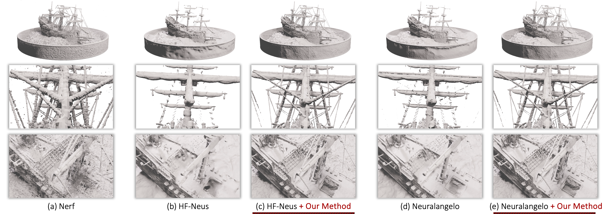

# RaNeuS
Implementation of RaNeuS: Ray-adaptive Neural Surface Reconstruction.




## Features
**This repository aims to provide a highly efficient while customizable boilerplate for research projects based on NeRF or NeuS.**

- acceleration techniques from [Instant-NGP](https://github.com/NVlabs/instant-ngp): multiresolution hash encoding and fully fused networks by [tiny-cuda-nn](https://github.com/NVlabs/tiny-cuda-nn), occupancy grid pruning and rendering by [nerfacc](https://github.com/KAIR-BAIR/nerfacc)
- out-of-the-box multi-GPU and mixed precision training by [PyTorch-Lightning](https://github.com/Lightning-AI/lightning)
- hierarchical project layout that is designed to be easily customized and extended, flexible experiment configuration by [OmegaConf](https://github.com/omry/omegaconf)

**Please subscribe to [#26](https://github.com/bennyguo/instant-nsr-pl/issues/26) for our latest findings on quality improvements!**

## Requirements
**Note:**
- To utilize multiresolution hash encoding or fully fused networks provided by tiny-cuda-nn, you should have least an RTX 2080Ti, see [https://github.com/NVlabs/tiny-cuda-nn#requirements](https://github.com/NVlabs/tiny-cuda-nn#requirements) for more details.
- Multi-GPU training is currently not supported on Windows (see [#4](https://github.com/bennyguo/instant-nsr-pl/issues/4)).
### Environments
- Install PyTorch>=1.10 [here](https://pytorch.org/get-started/locally/) based the package management tool you used and your cuda version (older PyTorch versions may work but have not been tested)
- Install tiny-cuda-nn PyTorch extension: `pip install git+https://github.com/NVlabs/tiny-cuda-nn/#subdirectory=bindings/torch`
- `pip install -r requirements.txt`
### Codes structure
Three core functions are organized under the main repo as:
```vim
▾ datasets/
    __init__.py
    blender.py
    colmap.py
    colmap_utils.py
    dtu.py
    hmvs.py
    utils.py
▾ models/
    __init__.py
    base.py
    geometry.py
    nerf.py
    network_utils.py
    neus.py
    ray_utils.py
    texture.py
    utils.py
▾ systems/
    __init__.py
    base.py
    criterions.py
    nerf.py
    neus.py
    utils.py
```
where `▾ systems` deploy the training by loading configurations parsed by `▾ models` for the inference model, and `▾ datasets` for loading data with different format.
Configuarations are placed under `▸ configs` folder, where each single hyperparameter can be fed in terminal as well.

## Run
### Training on NeRF-Synthetic
Download the NeRF-Synthetic data [here](https://drive.google.com/drive/folders/128yBriW1IG_3NJ5Rp7APSTZsJqdJdfc1) and put it under `load/`. The file structure should be like `load/nerf_synthetic/lego`.

Run the launch script with `--train`, specifying the config file, the GPU(s) to be used (GPU 0 will be used by default), and the scene name:
```bash
# train NeRF
python launch.py --config configs/nerf-blender-wbg.yaml --gpu 0 --train dataset.scene=lego tag=example

# train NeuS with mask
python launch.py --config configs/neus-blender.yaml --gpu 0 --train dataset.scene=lego tag=example
# train NeuS without mask
python launch.py --config configs/neus-blender-wbg.yaml --gpu 0 --train dataset.scene=lego tag=example
```
The code snapshots, checkpoints and experiment outputs are saved to `exp/[name]/[tag]@[timestamp]`, and tensorboard logs can be found at `runs/[name]/[tag]@[timestamp]`. You can change any configuration in the YAML file by specifying arguments without `--`, for example:
```bash
python launch.py --config configs/nerf-blender.yaml --gpu 0 --train dataset.scene=lego tag=iter50k seed=0 trainer.max_steps=50000
```
### Training on DTU
Download preprocessed DTU data provided by [NeuS](https://drive.google.com/drive/folders/1Nlzejs4mfPuJYORLbDEUDWlc9IZIbU0C?usp=sharing) or [IDR](https://www.dropbox.com/sh/5tam07ai8ch90pf/AADniBT3dmAexvm_J1oL__uoa). In the provided config files we assume using NeuS DTU data. If you are using IDR DTU data, please set `dataset.cameras_file=cameras.npz`. You may also need to adjust `dataset.root_dir` to point to your downloaded data location.
```bash
# train NeuS on DTU without mask
python launch.py --config configs/neus-dtu.yaml --gpu 0 --train
# train NeuS on DTU with mask
python launch.py --config configs/neus-dtu-wmask.yaml --gpu 0 --train
# train NeuS on DTU with mask using tricks from Neuralangelo (experimental)
python launch.py --config configs/neuralangelo-dtu-wmask.yaml --gpu 0 --train
```
Notes:
- PSNR in the testing stage is meaningless, as we simply compare to pure white images in testing.
- The results of Neuralangelo can't reach those in the original paper. Some potential improvements: more iterations; larger `system.geometry.xyz_encoding_config.update_steps`; larger `system.geometry.xyz_encoding_config.n_features_per_level`; larger `system.geometry.xyz_encoding_config.log2_hashmap_size`; adopting curvature loss.

### Training on Custom COLMAP Data
To get COLMAP data from custom images, you should have COLMAP installed (see [here](https://colmap.github.io/install.html) for installation instructions). Then put your images in the `images/` folder, and run `scripts/imgs2poses.py` specifying the path containing the `images/` folder. For example:
```bash
python scripts/imgs2poses.py ./load/bmvs_dog # images are in ./load/bmvs_dog/images
```
Existing data following this file structure also works as long as images are store in `images/` and there is a `sparse/` folder for the COLMAP output, for example [the data provided by MipNeRF 360](http://storage.googleapis.com/gresearch/refraw360/360_v2.zip). An optional `masks/` folder could be provided for object mask supervision. To train on COLMAP data, please refer to the example config files `config/*-colmap.yaml`. Some notes:
- Adapt the `root_dir` and `img_wh` (or `img_downscale`) option in the config file to your data;
- The scene is normalized so that cameras have a minimum distance `1.0` to the center of the scene. Setting `model.radius=1.0` works in most cases. If not, try setting a smaller radius that wraps tightly to your foreground object.
- There are three choices to determine the scene center: `dataset.center_est_method=camera` uses the center of all camera positions as the scene center; `dataset.center_est_method=lookat` assumes the cameras are looking at the same point and calculates an approximate look-at point as the scene center; `dataset.center_est_method=point` uses the center of all points (reconstructed by COLMAP) that are bounded by cameras as the scene center. Please choose an appropriate method according to your capture.
- PSNR in the testing stage is meaningless, as we simply compare to pure white images in testing.

### Testing
The training procedure are by default followed by testing, which computes metrics on test data, generates animations and exports the geometry as triangular meshes. If you want to do testing alone, just resume the pretrained model and replace `--train` with `--test`, for example:
```bash
python launch.py --config path/to/your/exp/config/parsed.yaml --resume path/to/your/exp/ckpt/epoch=0-step=20000.ckpt --gpu 0 --test
```

## Related Projects
- [ngp_pl](https://github.com/kwea123/ngp_pl): Great Instant-NGP implementation in PyTorch-Lightning! Background model and GUI supported.
- [instant-nsr-pl](https://github.com/bennyguo/instant-nsr-pl): Implementation of NeRF and NeuS for neural surface reconstruction based on Instant-NGP and the Pytorch-Lightning framework.
- [Instant-NSR](https://github.com/zhaofuq/Instant-NSR): NeuS implementation using multiresolution hash encoding.

## Citation
If you find this codebase useful, please consider citing:
```
@inproceedings{wang2023raneus,
  title={RaNeuS: Ray-adaptive Neural Surface Reconstruction},
  author={Wang, Yida and Tan, David and Tombari, Federico and Navab, Nassir},
  booktitle={Proceedings of the IEEE/CVF International Conference on 3D Vision},
  year={2023}
}
```
